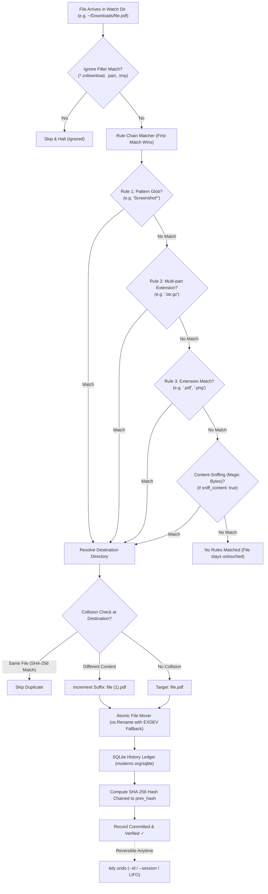

# 🧹 tidy — Deterministic Go CLI Folder Organizer

[](https://go.dev/)
[](https://github.com/spf13/cobra)
[](https://gitlab.com/cznic/sqlite)
[](https://github.com/fsnotify/fsnotify)
[](https://systemd.io/)
[-success?style=flat)]()

`tidy` is a fast, deterministic, and auditable command-line folder organizer engineered in Go. It continuously monitors and organizes designated directories (such as `~/Downloads`) using simple, declarative YAML rules. Designed to operate silently in the background without manual intervention, `tidy` intelligently handles in-progress downloads with quiet-period debouncing and routes files to their target destinations with sub-millisecond execution.

Unlike bloated desktop GUI applications or fragile Python automation scripts that require complex runtimes, `tidy` is built as **resilient, headless Linux infrastructure**. It ships as a single static binary with zero runtime dependencies, strictly guarantees top-level folder safety so already-organized subdirectories are never recursively mutated, and records every file movement into a pure-Go embedded SQLite ledger protected by a cryptographic SHA-256 hash chain with first-class undo capabilities.

---

## 💎 Core Capabilities & Architectural Comparison

| Feature | `tidy` | Hazel / organize (Python) / Shell Scripts |
| :--- | :--- | :--- |
| **Runtime Dependencies** | **Zero** — Single static Go binary (CGO-free via `modernc.org/sqlite`) | Heavy (requires Python interpreter, Node.js, external packages) |
| **Undo System** | **First-class & selective** — Undo by ID, session run, or LIFO rollback | None / Destructive manual recovery |
| **Audit Log Integrity** | **Cryptographic SHA-256 Hash Chain** (tamper-evident) | Unstructured plain text logs or none |
| **Folder Scoping** | **Top-level only guarantee** — Subfolders are never scanned | Accidental recursive loops into already-sorted directories |
| **Rule Debugger** | Built-in `tidy explain <file>` step-by-step trace | Guesswork and trial-and-error |
| **Shadowing Detection**| `tidy validate` warns on unreachable/starved rules | Silent rule overriding |
| **Execution Model** | Headless CLI + native **systemd user service** companion | Heavy background GUI / tray process |

### 🧰 Major Tech Stack & Tools

* **[Go](https://go.dev/) (1.22+)**: Fast, compiled language producing a single standalone static binary.
* **[Cobra](https://github.com/spf13/cobra)**: Robust CLI command architecture (used by Kubernetes `kubectl`, GitHub CLI `gh`, Docker).
* **[modernc.org/sqlite](https://gitlab.com/cznic/sqlite)**: 100% pure-Go embedded SQLite engine enabling CGO-free compilation with zero external C dependencies.
* **[fsnotify](https://github.com/fsnotify/fsnotify)**: Low-overhead kernel filesystem event listener (`inotify`) with per-file settling debouncing.
* **[systemd](https://systemd.io/)**: Native Linux user service supervisor for autonomous background execution.

---

## 🏗️ Architecture & Decision Pipeline



---

## 🚀 Quick Start & Installation Guide

Follow these steps from scratch to clone, compile, and run `tidy` on your machine:

### Step 1: Clone the Repository
Open your terminal and clone the repository from GitHub:
```bash
git clone https://github.com/vedantbladers/TIDY.git
```

### Step 2: Enter the Project Directory
```bash
cd TIDY
```

### Step 3: Install Binary & Start Background Daemon
Run the automated installation:
```bash
make install
```

#### What this does automatically:
1. Compiles a single static binary with stripped debug symbols to `~/.local/bin/tidy`.
2. Generates a starter configuration file at `~/.config/tidy/config.yaml` (if not already present).
3. Registers the `systemd` user service unit at `~/.config/systemd/user/tidy.service`.
4. Enables and starts the background watcher daemon immediately.

---

### Step 4: Preview Your Existing Downloads (Zero-Risk Dry Run)
Before moving any existing files, run a simulation to preview how `tidy` will sort your files:
```bash
tidy run --dry-run
```
*Outputs a color-coded preview showing every file and its planned destination without touching your disk.*

---

### Step 5: Clean Up Your Existing Downloads Backlog
Once you are happy with the preview, organize your existing files with a single command:
```bash
tidy run
```
*Organizes all matching top-level files in milliseconds and records every operation into the SQLite history ledger.*

---

### Step 6: Verify the Background Service
Check that the real-time background watcher daemon is actively running:
```bash
make status
# or: systemctl --user status tidy
```

You should see:
```text
● tidy.service - Tidy - Deterministic CLI Folder Organizer Daemon
     Loaded: loaded (~/.config/systemd/user/tidy.service; enabled; preset: enabled)
     Active: active (running)
```

---

### Step 7: Test Real-Time Organization
Drop a test file into `~/Downloads`:
```bash
touch ~/Downloads/test_document.pdf
```
Wait **1 second** (for the 500ms debounce write window to settle), then check:
```bash
ls -l ~/Downloads/Documents/test_document.pdf
```
`tidy` automatically sorted it into `Documents/`!

---

## 🛠️ Complete CLI Command Reference

`tidy` provides an intuitive, self-documenting command suite:

```text
Usage:
  tidy [command]

Available Commands:
  init        Write a starter configuration file to ~/.config/tidy/config.yaml
  validate    Validate configuration syntax and check for rule shadowing
  run         Organize files in watch directories according to configured rules
  watch       Run tidy as a background daemon watching folders in real time
  explain     Trace rule evaluation for a specific file without moving it
  log         Inspect organizing history and verify cryptographic ledger integrity
  undo        Reverse the latest organizing run, a specified run ID, or a single operation
```

### Command Highlights & Examples

#### 1. Trace a Rule (`tidy explain`)
Simulate how any file or path would be handled without modifying the filesystem:
```bash
tidy explain "invoice_september.pdf"
tidy explain "backup_2026.tar.gz"
tidy explain "download.iso.crdownload"
```

#### 2. History & Audit Log (`tidy log` / `tidy history`)
View recent organizing runs:
```bash
tidy log
# or use the history alias:
tidy history
```

Audit the cryptographic SHA-256 hash chain to verify zero database tampering:
```bash
tidy log --verify
```

Export move history for audits or external scripts:
```bash
tidy log --export csv > history.csv
tidy log --export json > history.json
```

#### 3. First-Class Undo (`tidy undo`)
Revert the most recent organizing run:
```bash
tidy undo
```

Revert a specific move operation by its record ID:
```bash
tidy undo --id 42
```

Revert an entire batch run by its session UUID:
```bash
tidy undo --session a4b0a48a-1122-3344-5566-778899aabbcc
```

---

## ⚙️ Configuration Schema (`~/.config/tidy/config.yaml`)

`tidy` is configured via a clean YAML file located at `~/.config/tidy/config.yaml`.

```yaml
# Directories to scan and organize (Top-level only, never recurses into subfolders)
watch_dirs:
  - ~/Downloads

# Optional content-sniffing fallback using magic bytes (true/false)
sniff_content: false

# Patterns to ignore during scans and active debounce windows
ignore:
  - "*.crdownload"
  - "*.part"
  - "*.tmp"
  - ".DS_Store"
  - "desktop.ini"
  - "*.download"

# Ordered rule definitions: Evaluated top-to-bottom (First matching rule wins!)
rules:
  - name: Documents
    extensions: [".pdf", ".doc", ".docx", ".txt", ".md", ".csv", ".xlsx", ".xls", ".pptx", ".ppt", ".json"]
    dest: ~/Downloads/Documents

  - name: Screenshots
    pattern: "Screenshot*"
    dest: ~/Downloads/Images/Screenshots

  - name: Images
    extensions: [".png", ".jpg", ".jpeg", ".gif", ".webp", ".svg"]
    dest: ~/Downloads/Images

  - name: Videos
    extensions: [".mp4", ".mkv", ".mov", ".avi", ".webm", ".flv"]
    dest: ~/Downloads/Videos

  - name: Archives
    extensions: [".zip", ".rar", ".7z", ".tar", ".tar.gz", ".tgz"]
    dest: ~/Downloads/Compressed

  - name: Installers
    extensions: [".deb", ".exe", ".msi", ".AppImage"]
    dest: ~/Downloads/Installers

  - name: Torrents
    extensions: [".torrent"]
    dest: ~/Downloads/Torrents
```

### Customizing & Reloading Rules
1. Open and edit your configuration:
   ```bash
   nano ~/.config/tidy/config.yaml
   ```
2. Validate syntax and check for rule shadowing:
   ```bash
   tidy validate
   ```
3. Restart the background service to apply changes:
   ```bash
   systemctl --user restart tidy
   ```

---

## 🖥️ Systemd Background Service Management

`tidy` runs seamlessly as a Linux user service without requiring root/sudo privileges:

| Operation | Command |
| :--- | :--- |
| **Check service status** | `systemctl --user status tidy` *(or `make status`)* |
| **View live streaming logs** | `journalctl --user -u tidy -f` |
| **Restart background daemon** | `systemctl --user restart tidy` |
| **Stop background daemon** | `systemctl --user stop tidy` |
| **Start background daemon** | `systemctl --user start tidy` |
| **Disable autostart on boot** | `systemctl --user disable tidy` |
| **Uninstall service & binary** | `make uninstall` |

---

## 🏛️ Codebase Structure

```text
tidy/
├── cmd/             # Cobra CLI commands (root, init, validate, run, watch, log, undo, explain)
├── config/          # YAML schema, path expansion, validation, and rule shadowing detection
├── daemon/          # fsnotify background watcher with quiet-period debouncing & size stability checks
├── db/              # Pure Go SQLite ledger (modernc.org/sqlite), schema, and SHA-256 hash chaining
├── engine/          # Rule matching, magic-byte sniffing, and rollback/undo execution
├── fs/              # Atomic moves (os.Rename), cross-device fallback (EXDEV), and collision strategies
├── scanner/         # Top-level directory scanner with symlink and directory recursion protection
├── config.yaml      # Starter configuration template
├── tidy.service     # Systemd user service definition unit
├── Makefile         # Build, test, install, status, clean, and uninstall automation
├── go.mod           # Go module declaration
└── main.go          # CLI entrypoint
```

---

## 🧪 Testing & Verification

Run the comprehensive unit and integration test suite:
```bash
make test
```
*Runs tests across all modules covering matcher ordering, compound extensions (`.tar.gz`), case insensitivity, collision strategies, cross-device copy fallback, hash chain validation, tampering detection, and single/batch undo.*

